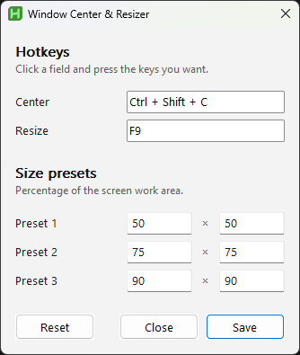

<div align="left">
  
  <h3 style="margin-left:100px;">Window Center & Resizer</h3>

  <div>
    
    
    
  <h3>The Open-Source Utility for Centering and Resizing Windows</h3>
  <p><a href="https://devail1.github.io/window-center-resize/"><strong>devail1.github.io/window-center-resize</strong></a></p>
</div>

<hr/>



## Features

Window Center & Resizer is a utility application for Windows that allows you to easily center and resize windows on your desktop using customizable keyboard shortcuts. It is a **single portable executable of about 1.2 MB** — nothing to install, and no runtime to bring along.

- **Center Window**: Quickly center the active window on your screen.
- **Resize Window**: Cycle the active window through three size presets, given as a percentage of the screen's work area. The defaults are 50%, 75% and 90%, and all three are editable.
- **Customizable Keybinds**: Configure your preferred key combinations for centering and resizing.

## Installation

[Download](https://github.com/devail1/window-center-resize/releases/latest/download/Window-Center-Resize.exe) the latest release and run it. There is no installer — it is one executable.

## Usage

1. **Center Window** — press the centering shortcut (default `Ctrl+Shift+C`) to center the active window without changing its size.
2. **Resize Window** — press the resize shortcut (default `F9`) to cycle through the size presets.
3. **Customization** — open **Settings** from the tray icon, or edit `settings.ini` next to the executable.

To change a shortcut, click its field in Settings and press the keys you want — the combination is captured as you press it. **Windows-key combinations are the one exception:** the field cannot capture them, so set those by editing `settings.ini` directly, using AutoHotkey syntax (`#` is Win, `^` Ctrl, `+` Shift, `!` Alt — for example `Center=#Up`). A Win-key shortcut set that way is kept, not overwritten, if you later open and save Settings.

### Windows running as administrator

A program that runs as administrator — Task Manager, an elevated terminal — cannot be moved by a program that does not. If you press a shortcut on one of those, the app will say so and offer **Restart as administrator** from the tray menu.

### Portability

The app is portable and keeps `settings.ini` **next to the executable**. Two consequences worth knowing:

- Moving the executable to a different folder starts it with default settings, because the old `settings.ini` stays behind.
- Two copies in two folders run independently, each with its own settings.

## Building from source

Requires [AutoHotkey v2](https://www.autohotkey.com/) installed **with the compiler** (Ahk2Exe). There is no other build chain and no runtime dependencies.

```
powershell -ExecutionPolicy Bypass -File build\build.ps1
```

The compiled executable is written to `dist\WindowCenterResizer.exe`.

## Inspiration

This project is inspired by the window centering helper freeware by [Kamil Szymborski](https://kamilszymborski.github.io/). Window Center & Resizer offers a modern approach to window management with additional features and extensive customization capabilities.

## Contributing

Contributions are welcome! If you have any suggestions, bug reports, or feature requests, please open an issue on the GitHub repository or submit a pull request.

## License

This project is licensed under the MIT License — see the [LICENSE](LICENSE) file for details.

## Acknowledgements

The icon is [`square-dot`](https://lucide.dev/icons/square-dot) from [Lucide](https://lucide.dev), used under the [ISC License](https://github.com/lucide-icons/lucide/blob/main/LICENSE).

Versions 1.x were built on [electron-react-boilerplate](https://github.com/electron-react-boilerplate/electron-react-boilerplate). Version 2.0.0 is a ground-up rewrite in AutoHotkey v2 and no longer contains any of that code.
